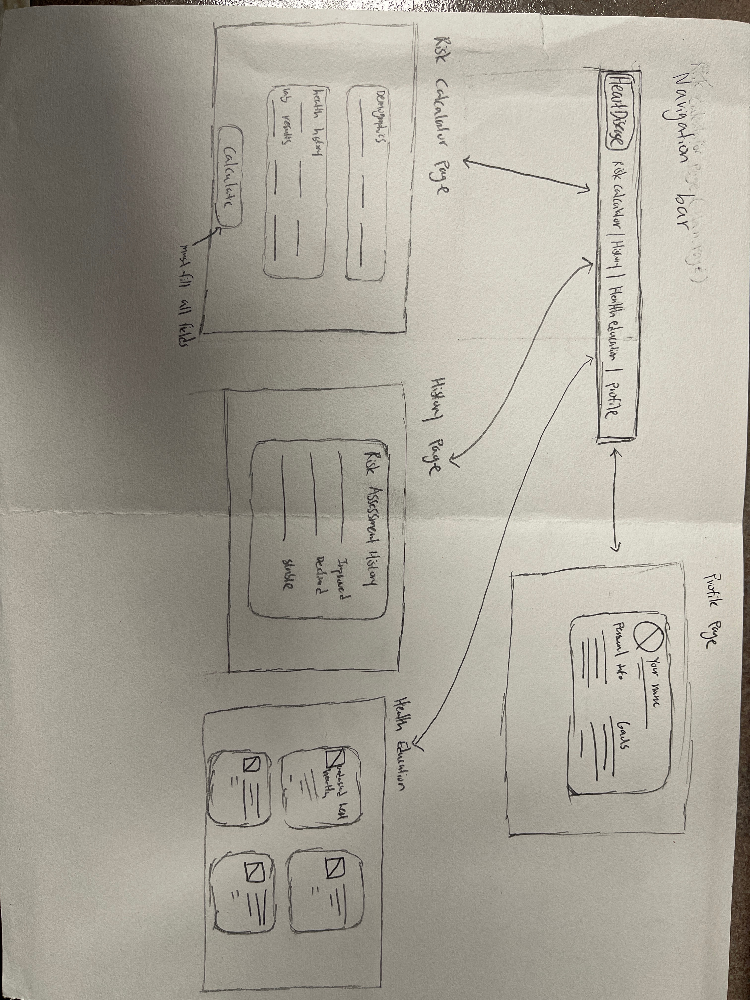

# Sketches

## **User Flow**  

### **1. Risk Calculator Page → Risk Prediction Page**  
- Users start at the **Risk Calculator Page** to assess their heart disease risk.  
- If the user **is not registered**, they will be **prompted to sign up** to view their prediction.  

### **2. Health Education Page (Optional)**  
- If a user is **identified as at risk**, they will be shown **resources on heart disease prevention**.  
- This page is optional but can be suggested based on the user's risk level.  

### **3. Profile Page Enhancements**  
- The **Profile Page** can include additional information beyond basic user identification, such as:  
  - Personal **health goals**  
  - Progress tracking  

### **4. Simple User Registration Prompt**  
- Once the user **runs the risk calculator**, they should be prompted to **register** to access their results.  

### **5. Risk Assessment History**  
- The **Risk Assessment History** should track past submissions to indicate whether the user's health has:  
  - **Improved**  
  - **Declined**  
  - **Remained stable**  

