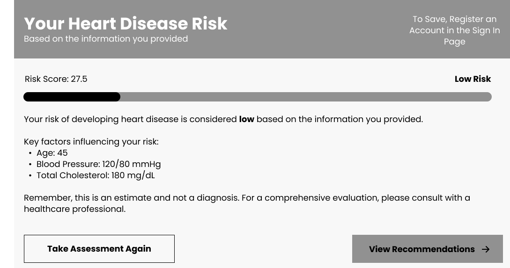

# Wireframes

[The Landing Page](Landing.png)

This is our Landing Page, which initalizes without the user signed out. It has a call to action button that will take the user to the risk calucator section. 

Here a user would land on the page and then click the call to action button.

[Risk Calculator](RiskCalculator.png)

This is our Risk Calculator Form, which allows users to input their biometrics. Originally, we used toggle buttons to represent YES or NO responses, but based on feedback that users might be confused by the toggles alone, we added clear labels indicating YES and NO.

We also received feedback that some users might not understand what certain biometrics mean. To address this, we included an infographic icon next to each item that provides a brief explanation, as well as a link at the bottom of the form that takes users to a more detailed information page.

Additionally, we learned that users were not aware they needed to sign in to save their information, so we added a clear message to let them know.

Here a user clicks the "Calculate Risk" button, a popup appears displaying their personalized results.

[About Page](About.png)

This is our About page, which provides users with detailed information about our model. We decided to include this page after our Software Engineering team posed the following question to their class:

> What factors would make you trust an AI model to assess your risks? Would transparency about its training data, accuracy, and methodology be enough, or would you need additional assurances?

The class responded that they would trust a well-trained model if there was full transparency about everything that goes into it.

Based on this feedback, we added this page to clearly explain the model’s training data, accuracy, and methodology, helping users better understand and trust the system.

Here a user scrolls through the page and understands our model.

[Help Page](Help.png)

This is our Help Page. This is a page that will help a user and give them general information on things they can do to improve their heart health.

Here a user scrolls through the page and understands what they can do to better themselves.

[How To](HowTo.png)

We were given information that some users might not know how to gain such biometrics, so we added this page.

A user would likey click on the help link in the calculate risk form and be navigated here, where they would be given information on how to proceed with getting their biometrics.

[Sign in](SignIn.png)

This is our sign in page. It gets navigated too after a user clicks 'Sign In' in the navbar. Ideally, a user would go to the calculate risk form, see that they would be able to save their history by signing in, and then navigate here to sign in and then back to calculate their risk.

[Dashboard](Dashboard.png)

This is our dashboard page. This is where user's can view this history.

Ideally, a user would sign in, calculate their risk, see what they can do and then navigate to the Dashboard to see their history.
